# R1: Problem and Solution

## Problem

Warhammer 40k players often face challenges in managing their collections of miniatures and tracking their battles. Traditional methods, such as spreadsheets or handwritten notes, are inefficient, prone to errors, and lack integration with game data and statistics.

### Solution

The **Warhammer 40k Collection and Battle Tracker API** addresses these issues by providing a streamlined and centralised solution for managing collections and tracking battles. It allows users to:

- **Manage Collections**: Add, update, and delete collections of miniatures, maintaining an accurate inventory.
- **Track Battles**: Record details of battles, including opponents, results, and dates.
- **User Authentication**: Securely manage user data with registration and login functionalities, ensuring only authorised users can access and modify their data.

This app enhances efficiency by providing a digital, organised, and user-friendly interface, making it easy to manage and retrieve data about Warhammer 40k collections and battles.

---

## R2: Task Allocation and Tracking

Tasks are allocated and tracked in Trello using the following structure:

### Trello Board Structure

**Board**: Warhammer 40k Collection and Battle Tracker API

**Lists**:

- **Backlog**
- **To Do**
- **In Progress**
- **Review**
- **Done**

## Trello Cards - Backlog

### Project Setup

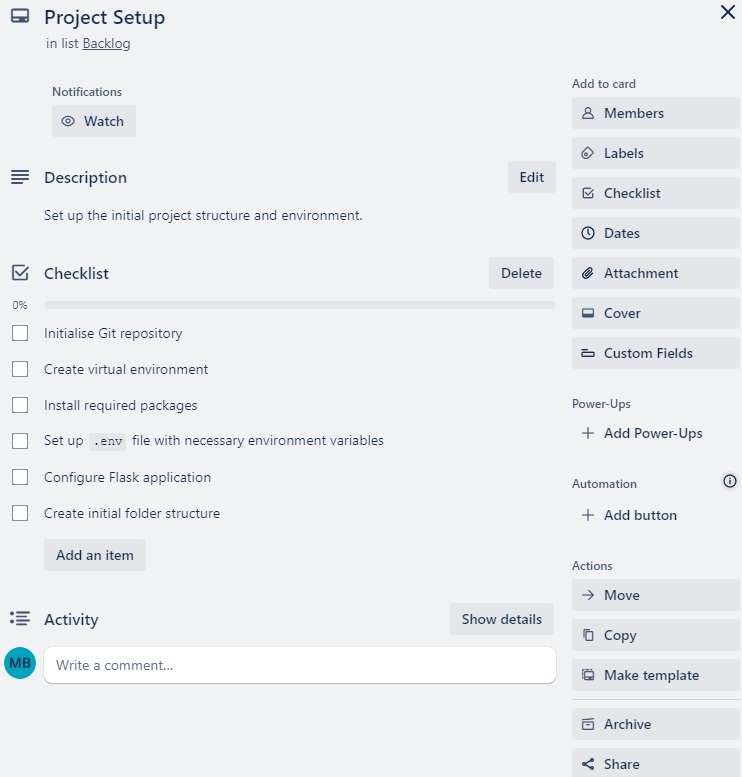

### Define User Model

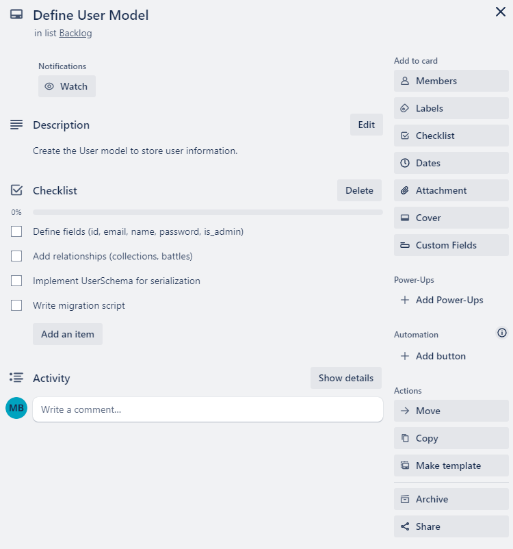

### Define Collection Model

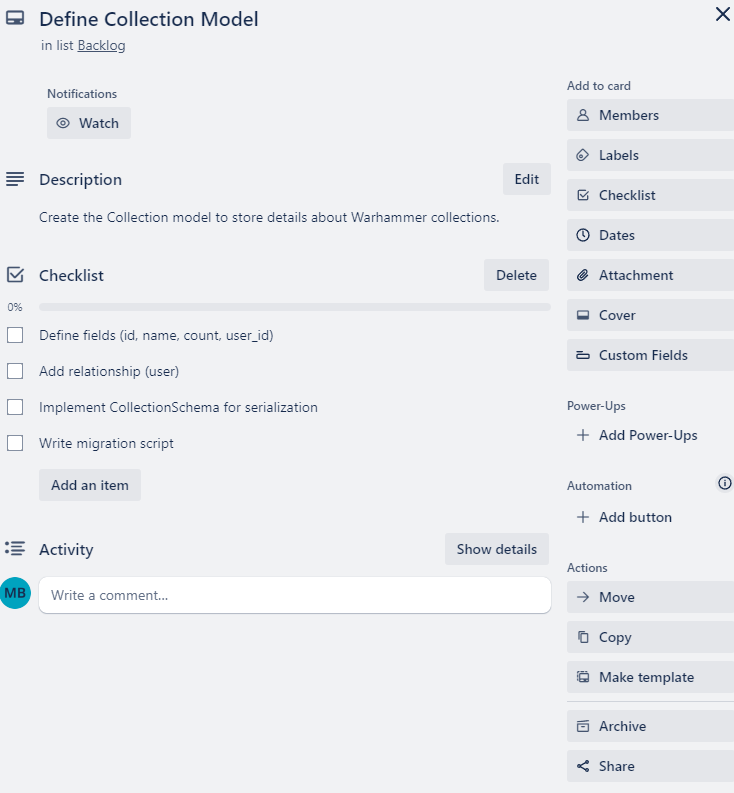

### Define Battle Model

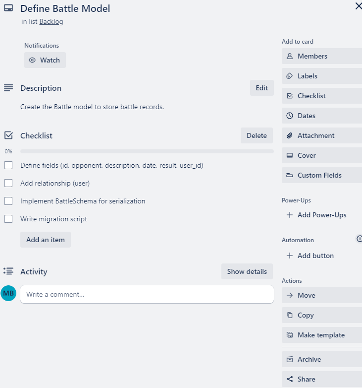

### User Registration Endpoint

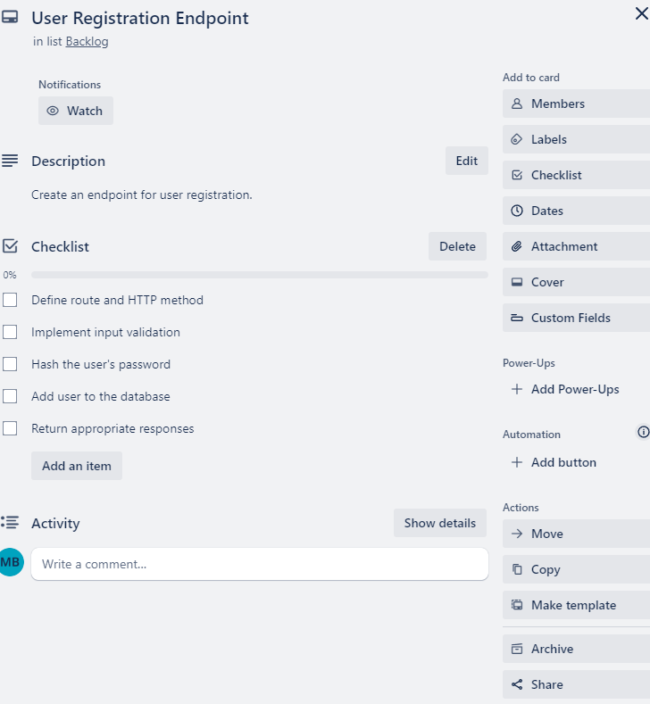

### User Login Endpoint

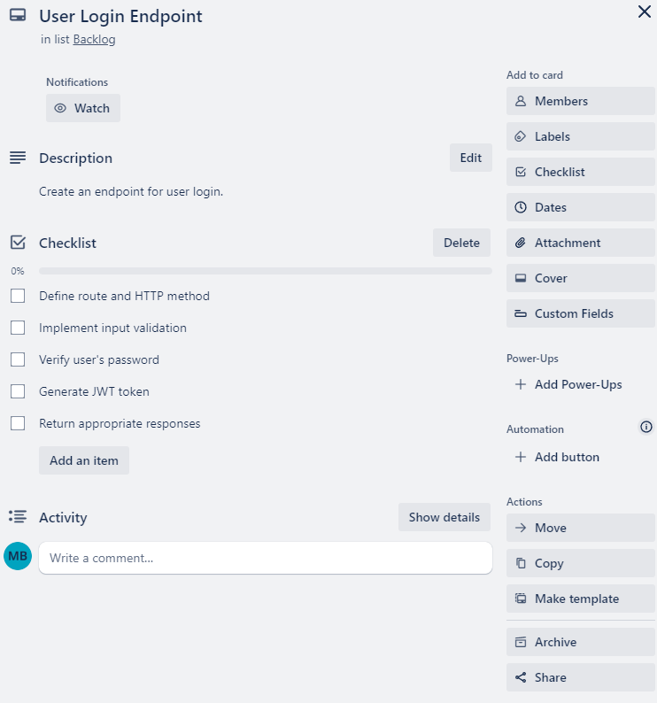

### Get All Users Endpoint

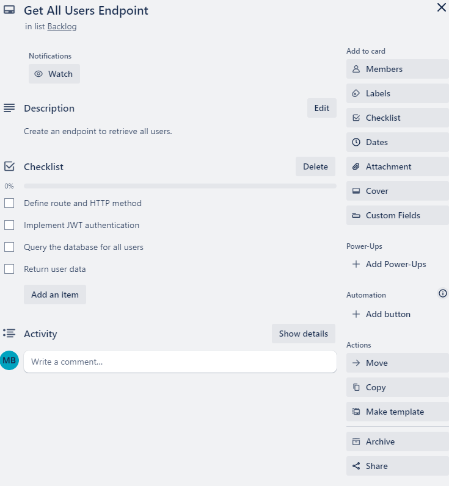

### Create Collection Endpoint and Get All Collections Endpoint

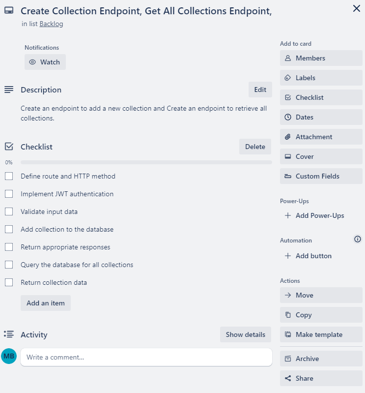

### Create Battle Endpoint, Get All Battles Endpoint

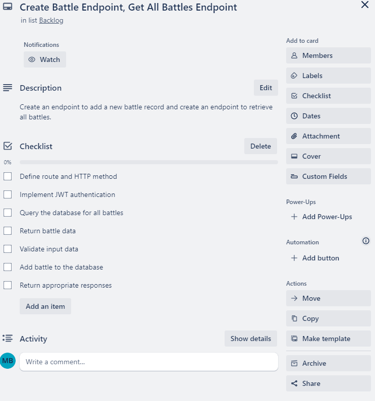

## Trello Cards - To Do

### User Authentication

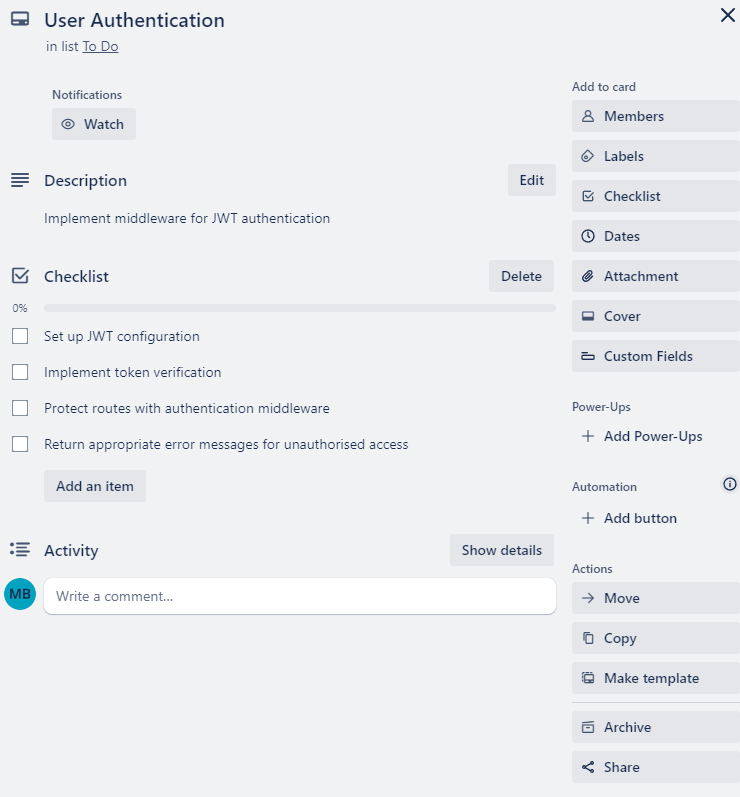

### Error Handling Middleware

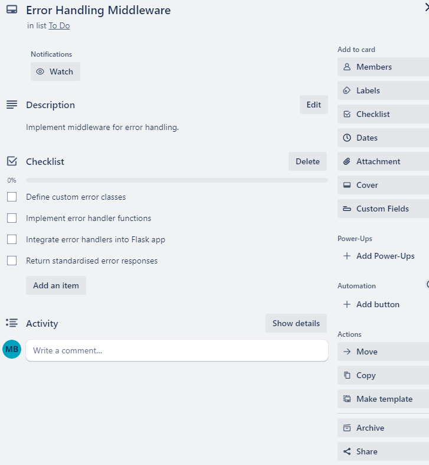

## Trello Cards - Review

### Code Review and Refactoring

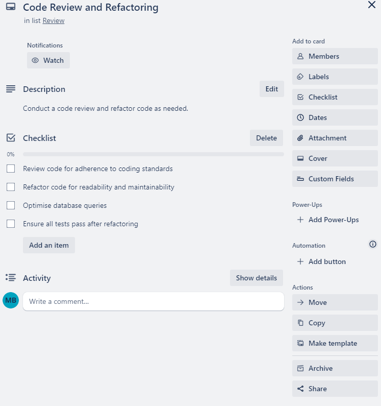

### Documentation

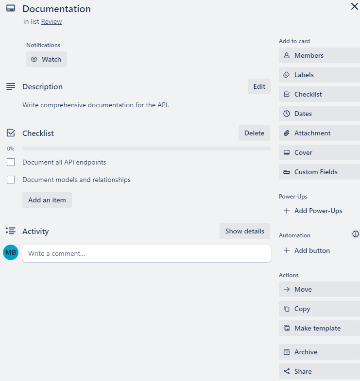

## Trello Cards - Done

## Run Application

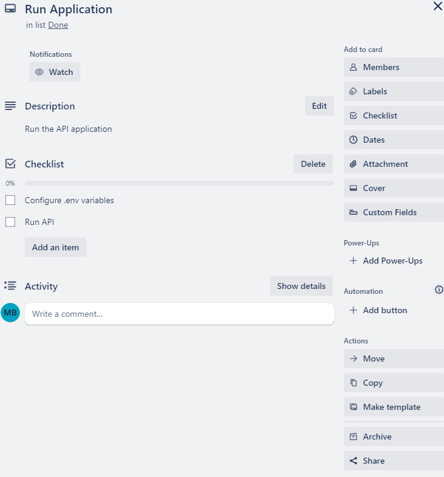

---

## R3: Third-Party Services, Packages, and Dependencies

The following third-party services, packages, and dependencies are used in this app:

- **Flask**: A lightweight WSGI web application framework for building the API.
- **Flask-SQLAlchemy**: Integrates SQLAlchemy with Flask for database interactions.
- **Flask-JWT-Extended**: Adds JWT support for secure user authentication.
- **Flask-Bcrypt**: Provides utilities for hashing passwords.
- **Marshmallow**: Used for object serialization/deserialization and validation.
- **Marshmallow-SQLAlchemy**: Integrates Marshmallow with SQLAlchemy for model serialization.
- **psycopg2-binary**: PostgreSQL database adapter for Python.
- **python-dotenv**: Loads environment variables from a `.env` file.

These packages enhance functionality, ensure secure authentication, and streamline database interactions.

---

## R4: Benefits and Drawbacks of the Database System

### Benefits

- **Relational Structure**: PostgreSQL supports complex queries and relationships between tables, which is ideal for managing the interconnected data in the application.
- **Data Integrity**: Enforces data integrity through constraints, foreign keys, and transactions.
- **Scalability**: Capable of handling large datasets and complex queries efficiently.
- **ACID Compliance**: Ensures reliable transaction processing (Atomicity, Consistency, Isolation, Durability).

### Drawbacks

- **Setup Complexity**: Can be more complex to set up compared to NoSQL databases.
- **Performance Overhead**: May have performance overhead for very large datasets due to the relational model and ACID compliance.
- **Scaling**: Horizontal scaling can be more challenging compared to some NoSQL solutions.

---

## R5: Object-Relational Mapping (ORM) System

### Features

- **Model Definition**: SQLAlchemy allows the definition of models as Python classes, which are then mapped to database tables.
- **Query Abstraction**: Provides a high-level API for querying the database using Pythonic constructs, abstracting away raw SQL.
- **Relationship Management**: Simplifies handling relationships between tables through ORM methods and attributes.
- **Validation and Serialization**: Integrates with Marshmallow to validate and serialize model instances.

### Purpose

The ORM system helps in bridging the gap between the object-oriented programming model and the relational database model, making it easier to manipulate database records as Python objects without writing SQL queries directly.

---

## R6: Entity Relationship Diagram (ERD)

## ERD Diagram

Below is the Entity Relationship Diagram (ERD) for the Warhammer 40k Collection and Battle Tracker API. The diagram depicts the structure of the database, showing how the tables are related to each other.

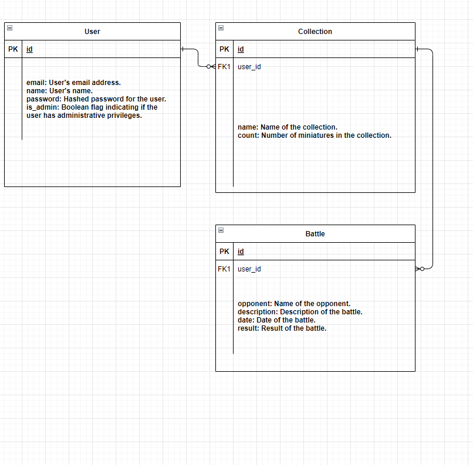

## Explanation

The ERD consists of three main tables: User, Collection, and Battle. Here’s how the relations between these models aid the database design:

### 1. User

- **Fields**: id (Primary Key), email, name, password, is_admin
- **Relationships**:
  - One-to-many with Collection
  - One-to-many with Battle

### 2. Collection

- **Fields**: id (Primary Key), name, count, user_id (Foerign Key)
- **Relationships**:
  - Many-to-one with User

### 3. Battle

- **Fields**: id (Primary Key), opponent, description, date, result, user_id (foreign key)
- **Relationships**:
  - Many-to-one with User

## How Relations Aid Database Design

- **Referential Integrity**: Relationships ensure that collections and battles are correctly linked to users, preserving data consistency. Foreign keys (user_id) enforce referential integrity, preventing orphaned records.
- **Efficient Queries**: By using foreign keys and relationships, the database can efficiently join tables. For example, retrieving all collections or battles for a specific user involves simple joins, leveraging indexed foreign keys for fast lookups.
- **Scalability**: The relational structure allows the database to scale as the amount of data grows. Users can have an increasing number of collections and battles without redesigning the schema, as relationships are maintained through scalable keys.
- **Data Normalisation**: The design follows normalisation principles, ensuring that redundant data is minimised. Each table stores distinct entities with clear boundaries, reducing duplication and easing maintenance.
- **Clear Model Boundaries**: The separation of User, Collection, and Battle into distinct tables clarifies their roles and responsibilities. This separation aids in developing, debugging, and extending the application, as each model handles a specific aspect of the data.

---

## R7: Implemented Models and Their Relationships

### Models

1. **User**
   - **Fields**: `id`, `email`, `name`, `password`, `is_admin`
   - **Relationships**: `collections`, `battles`

2. **Collection**
   - **Fields**: `id`, `name`, `count`, `user_id`
   - **Relationships**: `user`

3. **Battle**
   - **Fields**: `id`, `opponent`, `description`, `date`, `result`, `user_id`
   - **Relationships**: `user`

### Relationships

- **User to Collection**:
  - Each `Collection` belongs to a `User`. This relationship is represented by the `user_id` foreign key in the `Collection` table, linking it to the `id` in the `User` table. This allows the app to keep track of which user owns which collections.
  
- **User to Battle**:
  - Each `Battle` is recorded by a `User`. This relationship is represented by the `user_id` foreign key in the `Battle` table, linking it to the `id` in the `User` table. This allows the app to associate each battle record with the user who created it.

### How Relationships Aid Implementation

1. **Data Integrity**: Foreign keys ensure that collections and battles are always linked to valid users, preventing orphaned records.
2. **Efficient Data Retrieval**: Relationships facilitate efficient querying and data retrieval. For example, fetching all battles or collections for a specific user is straightforward.
3. **Scalability**: As the number of users, collections, and battles grows, the relational database structure supports scalability without requiring significant changes to the schema.
4. **Maintainability**: Clear relationships between models make the codebase easier to understand and maintain. Each model is responsible for a specific aspect of the data, leading to a more modular and maintainable codebase.

---

## R8: API Endpoints Usage

- **Register a User**
  - **HTTP Verb**: \`POST\`
  - **Path**: \`/register\`
  - **Body**:

```json

{
"email": "user@example.com",
"name": "User Name",
"password": "securepassword"
}
```

- **Response**
  - **Success**: 201 Created
  - **Failure**: 400 Bad Request

---

- **Login a User**
  - **HTTP Verb**: POST
  - **Path**: /login
  - **Body**:

```json
{
"email": "user@example.com",
"password": "securepassword"
}
```

- **Response**:
  - **Success**: 200 OK
  - **Failure**: 401 Unauthorized

---

- **Get All Users**
  - **HTTP Verb**: GET
  - **Path**: /users
  - **Headers**: Authorization: Bearer \<jwt_token\>
  - **Response**:
    - **Success**: 200 OK
    - **Failure**: 403 Forbidden

---

- **Get Specific User**
  - **HTTP Verb**: GET
  - **Path**: /users/\<int:id\>
  - **Headers**: Authorization: Bearer \<jwt_token\>
  - **Response**:
    - **Success**: 200 OK
    - **Failure**: 404 Not Found

---

- **Update Specific User**
  - **HTTP Verb**: PUT
  - **Path**: /users/\<int:id\>
  - **Headers**: Authorization: Bearer \<jwt_token\>
  - **Body**:

```json
{
"email": "user@example.com",
"name": "Updated Name",
"password": "newpassword"
}
```

- **Response**:
  - **Success**: 200 OK
  - **Failure**: 404 Not Found, 400 Bad Request

---

- **Delete Specific User**
  - **HTTP Verb:** DELETE
  - **Path:** /users/\<int:id\>
  - **Headers:** Authorization: Bearer \<jwt_token\>
  - **Response:**
    - **Success:** 200 OK
    - **Failure:** 404 Not Found

- **Create Collection**
  - **HTTP Verb:** POST
  - **Path:** /collections
  - **Headers:** Authorization: Bearer \<jwt_token\>
  - **Body:**
    - **json**

    ```json
    {
      "name": "Space Marines",
      "count": 50,
      "user_id": 1
    }
    ```

  - **Response:**
    - **Success:** 201 Created
    - **Failure:** 400 Bad Request

- **Get All Collections**
  - **HTTP Verb:** GET
  - **Path:** /collections
  - **Headers:** Authorization: Bearer \<jwt_token\>
  - **Response:**
    - **Success:** 200 OK
    - **Failure:** 403 Forbidden

- **Get Specific Collection**
  - **HTTP Verb:** GET
  - **Path:** /collections/\<int:id\>
  - **Headers:** Authorization: Bearer \<jwt_token\>
  - **Response:**
    - **Success:** 200 OK
    - **Failure:** 404 Not Found

- **Update Specific Collection**
  - **HTTP Verb:** PUT
  - **Path:** /collections/\<int:id\>
  - **Headers:** Authorization: Bearer \<jwt_token\>
  - **Body:**
    - **json**

    ```json
    {
      "name": "Updated Name",
      "count": 75
    }
    ```

  - **Response:**
    - **Success:** 200 OK
    - **Failure:** 404 Not Found, 400 Bad Request

- **Delete Specific Collection**
  - **HTTP Verb:** DELETE
  - **Path:** /collections/\<int:id\>
  - **Headers:** Authorization: Bearer \<jwt_token\>
  - **Response:**
    - **Success:** 200 OK
    - **Failure:** 404 Not Found

- **Create Battle**
  - **HTTP Verb:** POST
  - **Path:** /battles
  - **Headers:** Authorization: Bearer \<jwt_token\>
  - **Body:**
    - **json**

    ```json
    {
      "opponent": "Orks",
      "description": "Epic battle against the Orks",
      "date": "2024-06-21",
      "result": "Victory",
      "user_id": 1
    }
    ```

  - **Response:**
    - **Success:** 201 Created
    - **Failure:** 400 Bad Request

- **Get All Battles**
  - **HTTP Verb:** GET
  - **Path:** /battles
  - **Headers:** Authorization: Bearer \<jwt_token\>
  - **Response:**
    - **Success:** 200 OK
    - **Failure:** 403 Forbidden

- **Get Specific Battle**
  - **HTTP Verb:** GET
  - **Path:** /battles/\<int:id\>
  - **Headers:** Authorization: Bearer \<jwt_token\>
  - **Response:**
    - **Success:** 200 OK

- **Update Specific Battle**
  - **HTTP Verb**: PUT
  - **Path**: /battles/<int:id>
  - **Headers**: Authorization: Bearer <jwt_token>
  - **Body**:

```json
{
  "opponent": "Updated Opponent",
  "description": "Updated description",
  "date": "2024-06-22",
  "result": "Defeat"
}
```

- **Response**:
  - **Success**: 200 OK
  - **Failure**: 404 Not Found, 400 Bad Request

- **Delete Specific Battle**
  - **HTTP Verb**: DELETE
  - **Path**: /battles/<int:id>
  - **Headers**: Authorization: Bearer <jwt_token>
  - **Response**:
    - **Success**: 200 OK
    - **Failure**: 404 Not Found
